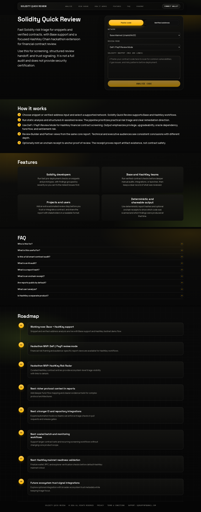
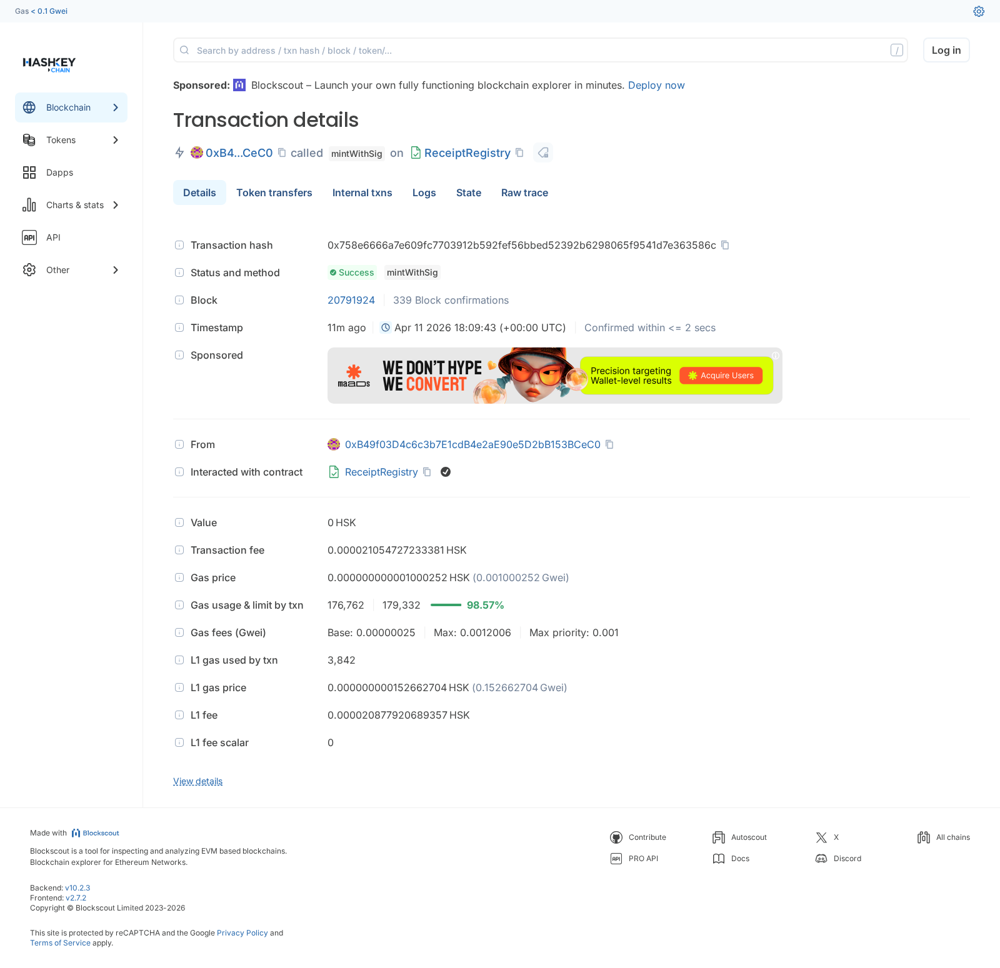
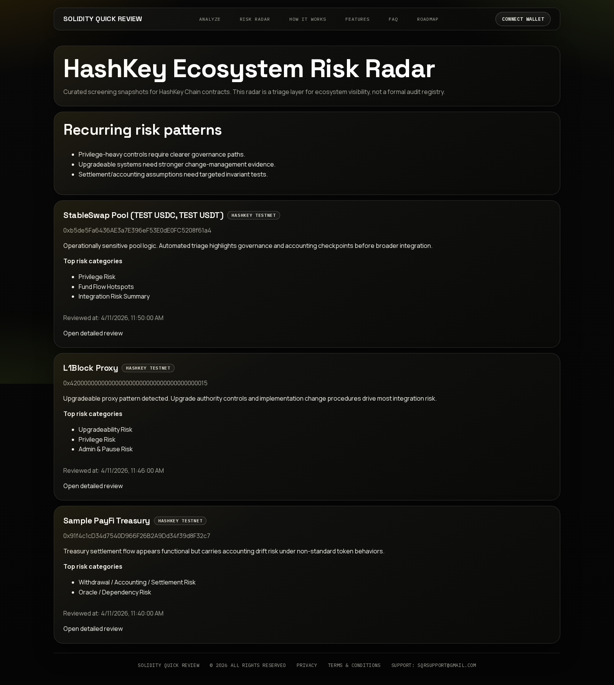

# Solidity Quick Review - HashKey Chain Hackathon Extension

## 1. Project summary
Solidity Quick Review is a fast Solidity risk-triage product for snippets and verified contracts. It produces structured findings and supports optional onchain proof that a review artifact existed.

For this hackathon, we extended the existing product with a HashKey-focused financial-contract review workflow while preserving Base support.

## 2. Why this fits HashKey Chain
HashKey Chain is aligned with finance-oriented onchain use cases. This extension focuses on practical screening for financial contracts (DeFi/PayFi context), with output designed for builder remediation and partner due-diligence handoff.

## 3. What was added for the hackathon
- HashKey testnet verified-contract analysis path
- DeFi / PayFi Review Mode
- Builder Report and Partner / Investor Report views
- HashKey receipt proof flow (artifact anchoring)
- HashKey Ecosystem Risk Radar page with curated entries

## 4. Supported networks and current status
- Base Mainnet (8453): supported (core product foundation)
- Base Sepolia (84532): supported (testing/staging)
- HashKey Testnet (133): supported for hackathon demo flow
- HashKey Mainnet (177): partial support (receipt contract deployed/verified; demo remains testnet-first)

Reference: `docs/hashkey-integration-params.md`

## 5. Demo flow
1. Open `https://solidity-scan.com`
2. Select `HashKey Testnet (133)`
3. Select `DeFi / PayFi Review Mode`
4. Analyze a verified contract
5. Review structured financial sections and readiness summary
6. Switch Builder / Partner report views
7. Mint receipt proof
8. Open Risk Radar entry detail

## 6. Key features
- Fast Solidity triage workflow
- Financial risk framing for HashKey extension use case
- Deterministic report hashing
- Optional onchain proof flow
- Curated Risk Radar visibility

Screenshots:

## 7. Technical notes
- Existing SQR architecture reused (no full rewrite)
- HashKey integration implemented as typed/config-driven extension
- Verified-source retrieval uses Blockscout-compatible API path
- Receipt flow uses EIP-712 authorization model

## 8. Known limitations
- Not a formal audit platform
- No security certification implied
- Complex protocols still require deep manual review
- Risk Radar is curated MVP, not full-chain indexing
- HashKey mainnet is partially integrated; default public demo path remains HashKey testnet-focused

## 9. Next steps
- Expand evidence depth for multi-contract financial systems
- Improve regression coverage across network-specific paths
- Finalize broader mainnet UX parity and status communication
- Grow Risk Radar coverage with stronger indexing support
